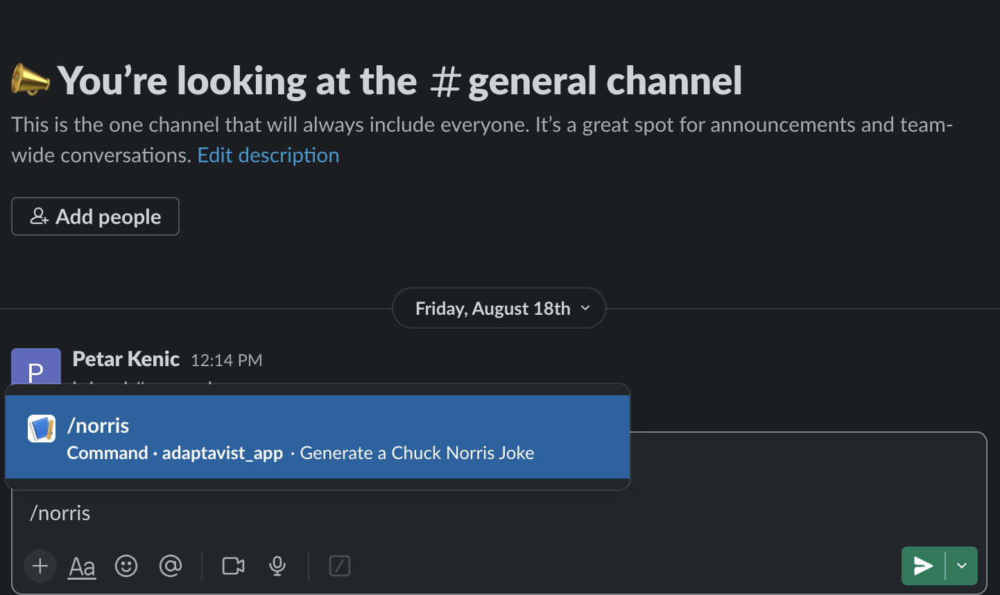
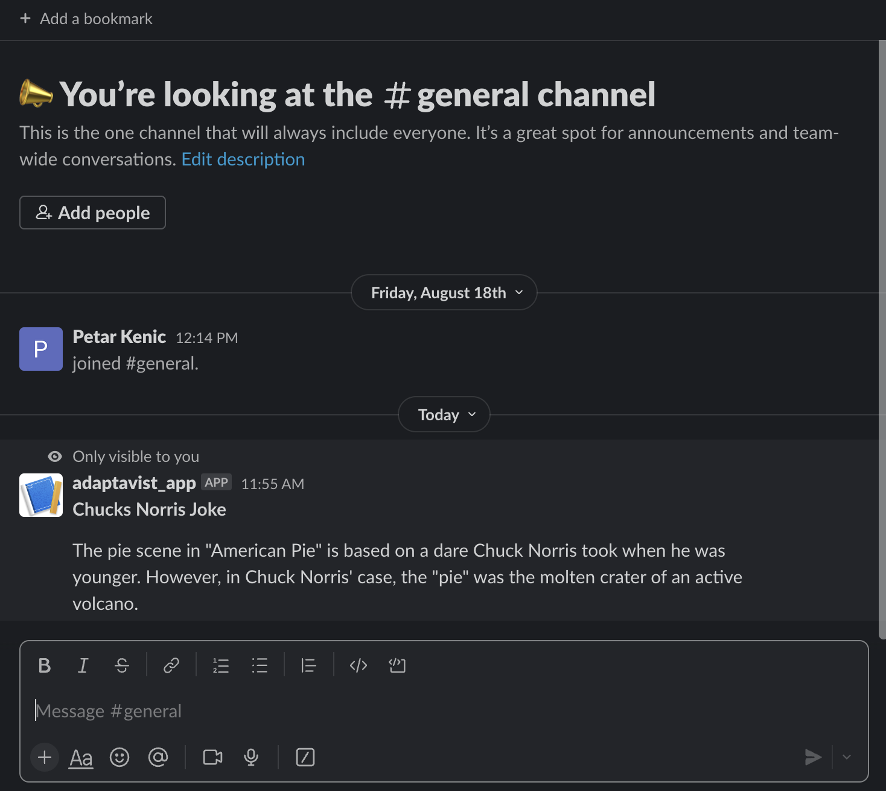

# Adaptavist Take Home Assignment 
## Technology Stack
The technology stack I chose to use was TypeScript, AWS CDK, and AWS Lambda. The reason for using this tech stack was because it is what Stackadapt uses and I was curious to see how AWS CDK works. I 

## How to build and run
You don't need to initialize the backend in order to use the Slack Application. You can just configure the Slack Application to point to the already deployed backend. If you wish to go down this route, skip the Backend Initialization guide and only do the Slack Application Initialization Guide.

### Backend Initialization Guide
In this guide I am assuming that you have the AWS CLI installed and tht you have credentials to provision infrastructure.
1. In the terminal, run git clone `GIT_REPO_URL` to clone this repository
2. In the terminal, run `npm run build`
3. In the terminal, run `cdk synth` to initialize a stack
4. Make sure to have bootrapped your CDK environment. If you haven't you can follow [the guide](https://docs.aws.amazon.com/cdk/v2/guide/serverless_example.html#:~:text=cdk%20synth-,Deploy%20and%20test%20the%20app,-Before%20you%20can)
5. In the terminal, run `cdk deploy` to deploy the infrastructure to AWS
6. On success, there should be a deployed API Gateway and Lambda.

### Slack Application Guide
1. Create a Slack Application
2. Add a Slash Command that sends a POST request to the API Gateway that was configured in the backend initialization guide. You can find this using the AWS Console or AWS CLI. However, if you did not complete this guide then please use this URL: https://on9inavid4.execute-api.us-east-2.amazonaws.com/prod
3. Install the App in your workspace
4. Use the slash command that you configured with the Slack Application, you can enter it to get a Chuck Norris joke

5. When you press enter and send the command, there should be a Chuck Norris Joke as an output

